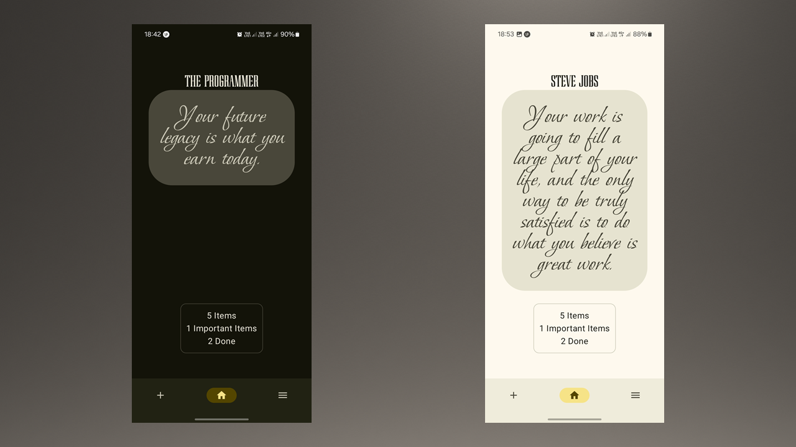
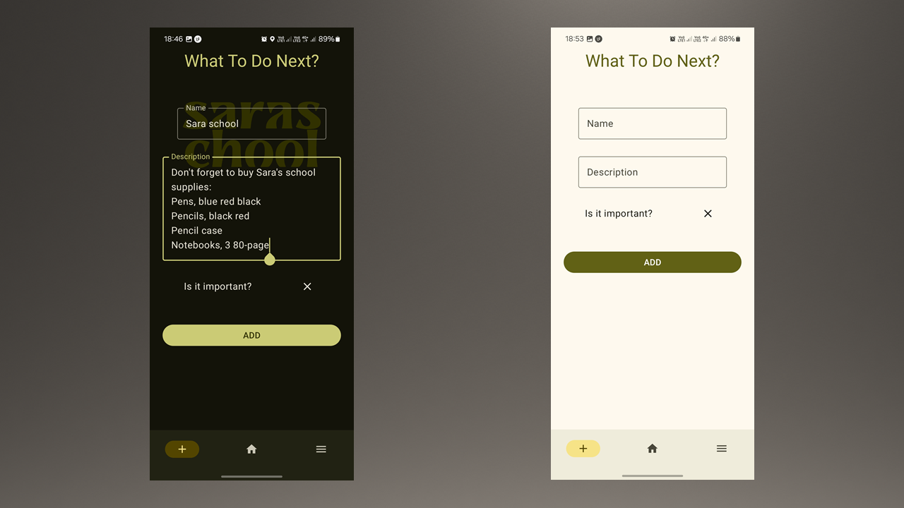
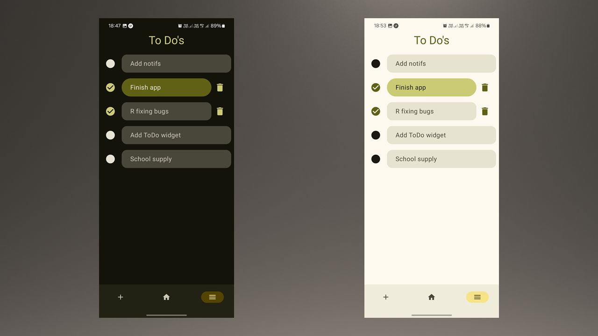
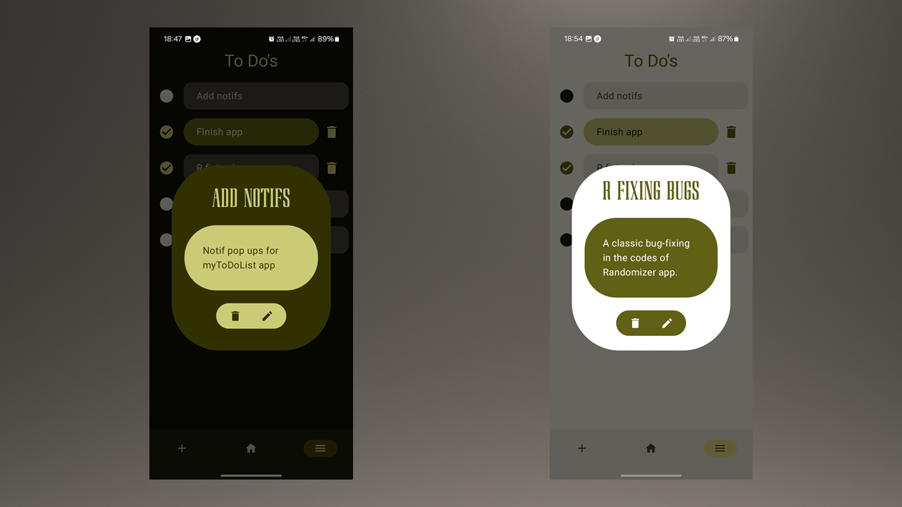
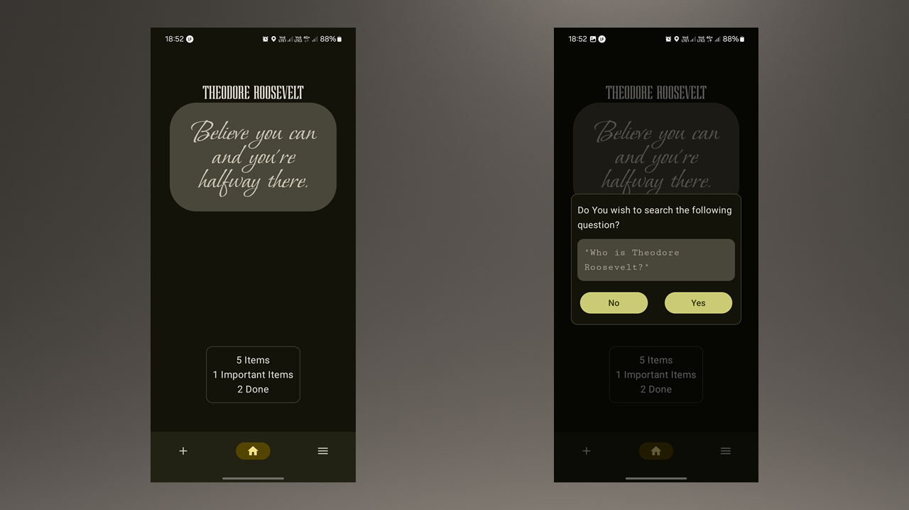

# 📱 MyToDoList app

- A *functional* and *user-friendly* app for your daily tasks.
- It has many features to boost **UX**.
- Dynamic **Light/Dark** themes for widening the circle of users.
- *Minimalist and modern* style.

## 🚀 About
This repository contains the source code for the **MyToDoList app**, an android application built with **Kotlin**.

---

## 🖼️ screenshots

>Home screen with a text that shows the overall status of your todo list.
>
>This screen contains a box that refreshes everytime with a new quote from a famous *celebrity*, *influencer*, or *philosopher*.
---

>The add screen contains two textfields for title and the desciption of the **new (or updated)** item.
>
>There is an option to mark the item as **important** in which it will be added with different color set in the *list screen*.
>
>The ***UI*** in this page is *dynamic* and refreshes with every character you write in the textfields.
---

>The list screen contains a box with chechbox for each item.
>
>There is a *smoothe* animation for when the user clicks on the checkbox of each item, revealing the *delete* icon button next to it.
---

>A dialogue that contains the full information of the items written by the users.
>
>There are two icon buttons here. **Delete** and **Edit**.
>
>The edit button in this dialogue takes all the information of this item to the ***Add screen***, so that the user can edit the details in familiar space.
---

>Back in the **Home screen**.
>
>The box with *famous quotes* is clicable. The box itself, when clicked, changes the quote to a *new one* from a *new celebrity*.
>
>The name of the *celebrity* is also clickable. The user, after pressing this text, will be given a dialogue that asks ***"Do you wish to search the following question?"***.
>
>The *following question* is, of course, the information about that celebrity. eg ***"Who is Steve Jobs?"***.
>
>After pressing **yes** in this dialogue, the user is sent to a google search about the *celebrity* in question.
---

### 📱 Download for free for **Android**
### 👉 [click here to download]([app/release/app-release.apk](https://github.com/MotamedKia/MyToDoList/releases/download/untagged-bd01af8bd754599756a7/app-release.apk))
